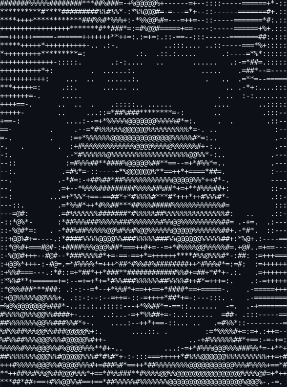
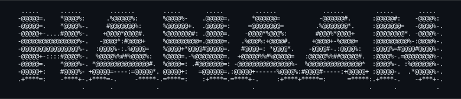

<h3><code>hanaan@github ~ $ ./stack.sh</code></h3>

**Networking**

**Languages**

**Databases**

**Tools & Platforms**

 
 

<h3><code>hanaan@github ~ $ whoami</code></h3>

<table>
<tr>
<td valign="top"></td>
<td valign="top"></td>
</tr>
</table>

 <b>TSE-1 @ SAP x WalkMe | MSc @ Leeds Beckett University</b>

In love with Technology!

 
 

<h3><code>hanaan@github ~ $ ./links.sh</code></h3>

 

